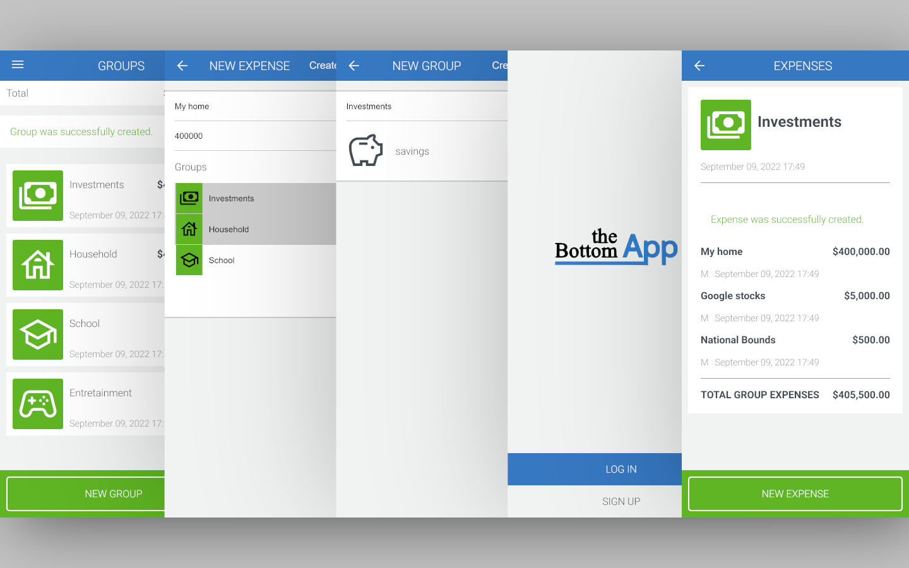

# The Bottom App



> mobile web application where you can manage your budget: you have a list of transactions associated with a category, so that you can see how much money you spent and on what.


## Live Demo

[Live Demo Link](https://evening-depths-79480.herokuapp.com/)

## Getting Started

### Setup

clone this repository at the desired directory, Install dependencies

```
bundle install
```

Start by setting up the db

```
rails db:create
rails db:schema:load
```

Start Rails Server

```
rails s
```
On your favourite browser go to the indicated route on the terminal


## Built With

- Ruby
- CSS
- Rails
- Devise
- Rspec


### Tests

Start by setting up the test set since we need a user to login and groups to navigate to.

```
bundle install
rails db:create
rails db:schema:load
rails db:seed RAILS_ENV=test
```

Make sure that the default user for the system exists in Postgres to avoid the error Fatally`:` Role '[user_name]' does not exist`

```
sudo su - posgres
createuser -s -r [user_name]
logout
```

finally to run all tests run

```
rspec --force-color --format documentation
```


## Authors

👤 **Juan Luis Palacios**

- GitHub: [@JuanLPalacios](https://github.com/JuanLPalacios)
- Twitter: [@JuanLuisPalac20](https://twitter.com/twitterhandle)
- LinkedIn: [LinkedIn](https://www.linkedin.com/in/juan-luis-palacios-p%C3%A9rez-95b39a228/)

## Acknowledgments

- [Gregoire Vella](https://www.behance.net/gregoirevella) in Behance for his [design](https://www.behance.net/gallery/19759151/Snapscan-iOs-design-and-branding?tracking_source=)
- [microverse](http://www.microverse.org) for the config templates

## 🤝 Contributing

Contributions, issues, and feature requests are welcome!

Feel free to check the [issues page](./issues).

## Show your support

Give a ⭐️ if you like this project!

## 📝 License

This project is [MIT](./LICENSE) licensed.
